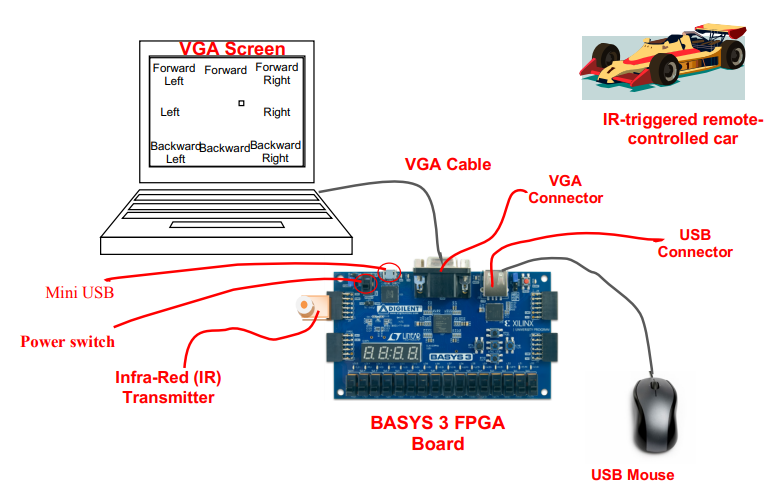
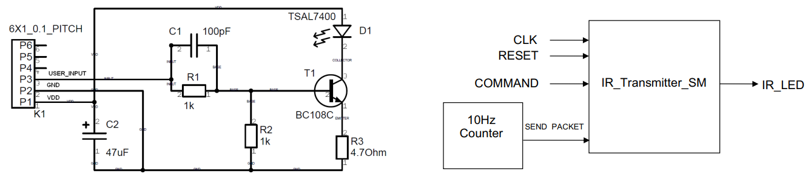
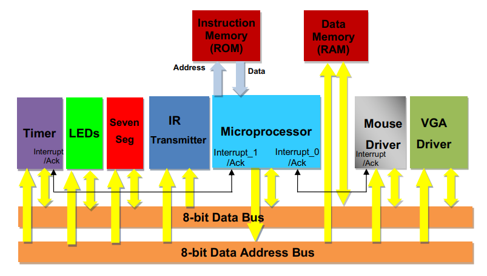

 

# FPGA-Based Remote Car Control:

## Objective:  
Develop a microprocessor-based system on an FPGA (Field-Programmable Gate Array) to remotely control toy race-cars. This system should be interfaced with a VGA screen and controlled through a mouse, using the BASYS 3 FPGA board. I worked on the Infra-Red Transmitter Interface for the team.

## System Components:

1. **Microprocessor**: This acts as the brain of the system.
2. **VGA Interface**: To display the control system.
3. **Mouse Interface**: The user will hover the mouse pointer over the VGA screen to command the movement of the remote car.
4. **Infra-Red (IR) Transmitter Interface**: This will send the movement commands to the remote-controlled car.

# Functionality:
## High-level architecture:

- A user hovers the mouse pointer over a specific area on the VGA screen.
- Depending on the position of the mouse pointer, the remote car will move in the corresponding direction. For instance, if the mouse pointer is at the top center of the VGA screen, the car will move forward.

## Infra-red Transmitter:

I was assigned to create the IR Transmitter code for the Artix-7 Xilinx FPGA in my team. The IR Transmitter module allows remote control of cars using the Artix-7 FPGA chip. Pulse codes specific to car colors (RED, BLUE, GREEN, YELLOW) are generated for this purpose. Below is the high-level architecture of the code and the IR Transmitter circuit that was built.

The `CLK`, `RESET`, and `COMMAND` input is combined inside `IRTransmitter.v` and the `10Hz Counter` input is done inside `TenHz_cnt.v` file. They are then both tied in the `IRTransmitterSM.v` file to send the intended output frequency signal.

## Pulse Code Structure

Every car color follows a specific packet structure generated at 10Hz, including:
- Start
- Car Select
- Gap
- Directional Asserts/De-Asserts (Right, Left, Backward, Forward)

**Examples:**
- **Blue Cars**:
  - Frequency: 36KHz
  - Start: 191, Gap: 25, CarSelect: 47
  - Directional Assert: 47, De-Assert: 22
- **Red Cars**:
  - Frequency: 36KHz
  - Start: 192, Gap: 24, CarSelect: 24
  - Directional Assert: 48, De-Assert: 24
- (Details for other colors omitted for brevity)

## State Machine

The generic state machine for generating pulse codes uses parameters like `StartBurstSize`, `CarSelectBurstSize`, `GapSize`, `AssertBurstSize`, and `DeAssertBurstSize`.

COMMAND is a 4-bit value denoting directions:
- Bit 0: Right
- Bit 1: Left
- Bit 2: Backward
- Bit 3: Forward

# Programmer's Guide: 

The overall code can then be connected together to work as intended. They are all connected together in `TOP_stim.v` code file.
> Note: The available code in this repository is enough only for the infra-red transmitter for the remote car which needs a mouse driver and VGA driver code.

## ALU.v:
- 8-bit load-store architecture processor.
- Two internal registers: A and B.
- ALU performs: Addition, Subtraction, Multiplication, Shifts (left & right), Increment & Decrement (A & B), and Comparisons (A == B, A > B, A < B).
- 4-bit operation code defines the ALU operation.

## Processor.v:

- **Instructions** (6 types):
  1. Memory reads/writes for Registers A/B.
  2. ALU operations, results saved in Register A/B.
  3. Conditional/Unconditional jump operations based on register A and B contents.
  4. Function call and return.
  5. Dereference Registers A/B.

- **Instruction Format**: Varies in word length but issued in consecutive bytes.

- **Instruction Examples**:
  - A <- [Mem] (2 bytes): Read memory to Register A.
  - A <- ALU_OP(A,B) (1 byte): ALU operation, result to Register A.
  - BREQ ADDR (2 bytes): Conditional branch based on equality of Registers A/B.

- **Architecture**: Uses RISC (Reduced Instruction Set Computing), favored for simplicity and speed over CISC (Complex Instruction Set Computing).

- **Operation**: Behavior follows a state machine structure with sequential pipeline stages for each operation. The Verilog code provided showcases this behavior and includes configurations for reading/writing from memory, ALU operations, branch operations, etc.

## RAM.v:
- 128-byte data memory module.
- Interfaces with an 8-bit bus for data transfer.
- Responds to reads and writes based on an 8-bit address bus.
- Memory contents can be preloaded from `Complete_Demo_RAM.txt`.
- Has an internal tristate buffer to manage bus connections.

## ROM.v:
- 256-byte instruction memory module.
- Dedicated 8-bit data bus to output instructions.
- Uses an 8-bit address bus to fetch instructions.
- Contents are initialized from `Complete_Demo_ROM.txt`.
- Direct point-to-point connection without the need for decoding.

# License

This project is licensed under the [MIT License](https://opensource.org/licenses/MIT) and is open for any contributions.

> All documents are referenced from the University of Edinburgh
